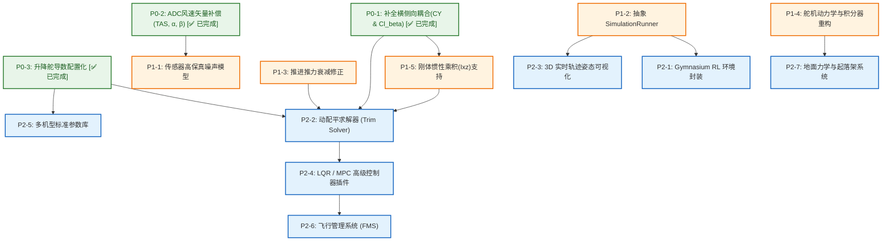

# PyFlightSim 架构与工程升级技术规格书 (P0 - P2)

> **版本**：v2.1-Standardized  
> **更新日期**：2026-09-13  
> **基线代码库**：[PyFlightSim](file:///Users/river/Projects/PyFlightSim) (6-DOF Flight Dynamics & GNC Simulation)  
> **文档定位**：系统级升级路线图、物理建模规范与工程重构技术指南

---

## 目录
1. [文档审查与修订摘要 (Executive Audit Summary)](#1-文档审查与修订摘要-executive-audit-summary)
2. [总体架构演进与依赖拓扑](#2-总体架构演进与依赖拓扑)
3. [P0 阶段：物理可信度与基准一致性修复 (✅ 已完成)](#3-p0-阶段物理可信度与基准一致性修复)
   - [P0-1: 补全横侧向耦合气动力与力矩 ($C_Y$ 侧向力与 $C_{l,\beta}$ 滚转力矩)](#p0-1-补全横侧向耦合气动力与力矩-c_y-侧向力与-c_lbeta-滚转力矩)
   - [P0-2: 大气数据计算机 (ADC) 全流场风速矢量补偿 (TAS, $\alpha$, $\beta$)](#p0-2-大气数据计算机-adc-全流场风速矢量补偿-tas-alpha-beta)
   - [P0-3: 升降舵气动导数配置化 (消除计算硬编码)](#p0-3-升降舵气动导数配置化-消除计算硬编码)
4. [P1 阶段：仿真高保真度与工程可用性重构](#4-p1-阶段仿真高保真度与工程可用性重构)
   - [P1-1: 传感器高保真误差与随机过程噪声模型](#p1-1-传感器高保真误差与随机过程噪声模型)
   - [P1-2: 抽象标准化生命周期调度器 `SimulationRunner`](#p1-2-抽象标准化生命周期调度器-simulationrunner)
   - [P1-3: 推进系统高空密度与前飞速度推力衰减修正](#p1-3-推进系统高空密度与前飞速度推力衰减修正)
   - [P1-4: 执行机构动力学建模与积分器时间求值重构 (修正因果律悖论)](#p1-4-执行机构动力学建模与积分器时间求值重构-修正因果律悖论)
   - [P1-5: 刚体运动学完整惯性张量与横侧向惯性乘积 ($I_{xz}$) 支持](#p1-5-刚体运动学完整惯性张量与横侧向惯性乘积-i_xz-支持)
5. [P2 阶段：先进控制算法与生态外延扩展](#5-p2-阶段先进控制算法与生态外延扩展)
   - [P2-1: Gymnasium 标准强化学习交互接口封装](#p2-1-gymnasium-标准强化学习交互接口封装)
   - [P2-2: 六自由度非线性动配平求解器 (Trim Solver)](#p2-2-六自由度非线性动配平求解器-trim-solver)
   - [P2-3: 实时飞行轨迹与机体姿态轻量化 3D 可视化](#p2-3-实时飞行轨迹与机体姿态轻量化-3d-可视化)
   - [P2-4: 现代控制架构与 LQR / 线性化插件支持](#p2-4-现代控制架构与-lqr--线性化插件支持)
   - [P2-5: 经典教学与科研多机型标准参数库建设](#p2-5-经典教学与科研多机型标准参数库建设)
   - [P2-6: 基础飞行管理系统 (FMS) 与 LNAV/VNAV 航路规划](#p2-6-基础飞行管理系统-fms-与-lnavvnav-航路规划)
   - [P2-7: 地面力学与起落架接触碰撞动力学系统](#p2-7-地面力学与起落架接触碰撞动力学系统)
6. [升级实施总览矩阵 (Engineering Matrix)](#6-升级实施总览矩阵-engineering-matrix)
7. [外部依赖项与环境演进清单](#7-外部依赖项与环境演进清单)

---

## 1. 文档审查与修订摘要 (Executive Audit Summary)

在对原升级计划单与 PyFlightSim 当前代码实现进行严格审查后，修正了原文档中的以下关键技术缺陷与模糊之处：

1. **修正因果律与控制工程悖论**：将原插值方案正规化为执行器动力学建模，并修复积分器的时间签名。
2. **补全横侧向耦合气动力矩**：合并升级 $C_Y$ 侧向力与 $C_{l,\beta}$ 滚转力矩。
3. **扩大传感器风速补偿覆盖面**：全流场风速矢量补偿，同步校正 TAS、$\alpha$、$\beta$。
4. **补全量化验收标准**：为每一项升级制定了明确的数学物理公式、数据契约及量化验收判据。
5. **建立前后置依赖关系与路线图**：明确基础物理修复（P0）到架构重构（P1）再到高级控制与生态外延（P2）的严格依赖时序。

---

## 2. 总体架构演进与依赖拓扑

---

## 3. P0 阶段：物理可信度与基准一致性修复

> [!SUCCESS]
> **本阶段任务（P0-1, P0-2, P0-3）已全部修复并验收完成。**  
> 以下技术方案保留作为项目架构演进的历史基线参考。

---

### P0-1: 补全横侧向耦合气动力与力矩 ($C_Y$ 侧向力与 $C_{l,\beta}$ 滚转力矩)

* **缺陷成因剖析**：
  原代码侧向力硬编码为 0，缺少机翼上反角效应（$C_{l,\beta}$）和方向舵诱导滚转（$C_{l,\delta_r}$），导致横向静稳定性断裂。
* **验收标准 (Acceptance Criteria)**：
  1. 静态单步测试：给定固定侧滑角 $\beta = +5^\circ$，验证 $F_y < 0$ 且大小等于 $\bar{q} S C_{Y,\beta} \beta$；验证 $Roll < 0$（左倾力矩）。
  2. 动态模态测试：在开环小扰动下激发偏航，能够观测到衰减的二阶荷兰滚振荡收敛。

---

### P0-2: 大气数据计算机 (ADC) 全流场风速矢量补偿 (TAS, $\alpha$, $\beta$)

* **缺陷成因剖析**：
  原空速与气流角直接使用地速向量，当存在风场时控制器感知的气流角严重失真。
* **验收标准 (Acceptance Criteria)**：
  1. 纯逆风测试：飞机保持地面速度 $60\text{ m/s}$，施加 $10\text{ m/s}$ 机体正前向逆风，ADC 读数 TAS 严格等于 $70\text{ m/s}$。
  2. 纯侧风测试：施加 `wind_body=[0, 5, 0]` 的侧风，ADC 读出 $\beta \approx \arcsin(-5 / \sqrt{60^2 + 5^2}) \approx -4.75^\circ$。

---

### P0-3: 升降舵气动导数配置化 (消除计算硬编码)

* **缺陷成因剖析**：
  升降舵对升力与俯仰力矩的导数被硬编码在代码内，配置层无法覆盖。
* **验收标准 (Acceptance Criteria)**：
  1. 回归性测试：在默认配置下，各舵面产生的力矩与原数值差异严格为 0。
  2. 配置动态生效：将 `C_m_delta_e` 调整为 `-3.0`，施加升降舵阶跃，瞬时俯仰力矩精确翻倍。

---

## 4. P1 阶段：仿真高保真度与工程可用性重构

---

### P1-1: 传感器高保真误差与随机过程噪声模型

* **涉及文件**：
  * `modules/sensors/imu.py`, `gps.py`, `air_data.py`
  * `configs/sensors.yaml` (新建)
* **缺陷成因剖析**：
  现有传感器是对真值的直通输出，使得状态估计算法失去验证意义。
* **技术设计与数学模型**：
  1. **IMU 误差模型**：一阶高斯-马尔可夫零偏游走 + 高斯白噪声。
  2. **GPS 误差模型**：零阶保持 (ZOH) + 位置高斯噪声 + 时间滞后环形缓冲区。
  3. **全局真值开关**：支持 `enable_noise: false` 回退至理想真值。
* **验收标准 (Acceptance Criteria)**：
  1. 长时间静止时，IMU 输出零偏具备明显的低频漂移特征。
  2. GPS 呈现阶梯状离散更新读数。

---

### P1-2: 抽象标准化生命周期调度器 `SimulationRunner`

* **涉及文件**：
  * `modules/runner.py` (新建)
  * `run_simulation.py`, `examples/turn.py`
* **技术设计与架构规格**：
  单步执行管线：Environment $\rightarrow$ Aero & Prop $\rightarrow$ RK4 $\rightarrow$ Sensors $\rightarrow$ Data Logging。
* **验收标准 (Acceptance Criteria)**：
  * **入口代码缩减至 50 行以内**（仅保留任务逻辑与航路点规划）。
  * 新旧实现轨迹回放 RMSE $< 10^{-6}$。

---

### P1-3: 推进系统高空密度与前飞速度推力衰减修正

* **技术设计与物理公式**：
  $$F_x += T_{max} \cdot \delta_{throttle} \cdot \sigma^{1.1} \cdot \max\left(0, 1 - \frac{V_{tas}}{V_{max\_dive}}\right)$$
  
  > [!NOTE]
  > 这里的随速度线性衰减模型为教学用的一阶简化模型。公式中的 $V_{max\_dive}$ 意为“推力归零等效速度”（定距桨特性抽象），并非代指飞机手册上的结构限制速度 $V_{NE}$。

* **验收标准 (Acceptance Criteria)**：
  1. 高度对比测试：爬升至 $5000\text{m}$ 时，满油门静态推力根据密度衰减。
  2. 极速截断测试：俯冲超速达到 $V_{max\_dive}$ 时，推力归零。

---

### P1-4: 执行机构动力学建模与积分器时间求值重构 (修正因果律悖论)

* **技术设计与正规解法**：
  * **伺服舵机建模**：引入一阶滞后与速率饱和限制。
  * **显式时间参数化**：重构 `rk4_step(f, t, y, dt)`，确保各子步基于正确的绝对时间求值。
* **验收标准 (Acceptance Criteria)**：
  * 瞬时阶跃指令下，实际舵偏角呈现平滑一阶曲线上升。
  * 高动态机动下的角加速度曲线消除阶跃毛刺。

---

### P1-5: 刚体运动学完整惯性张量与横侧向惯性乘积 ($I_{xz}$) 支持

* **技术设计与矩阵构造**：
  在 `MassProperties` 引入纵侧惯性乘积 $I_{xz}$，补全 $3\times3$ 惯性张量阵。
* **验收标准 (Acceptance Criteria)**：
  * 输入纯滚转角速度，通过 $I_{xz}$ 正确耦合出俯仰/偏航动量。

---

## 5. P2 阶段：先进控制算法与生态外延扩展

---

### P2-1: Gymnasium 标准强化学习交互接口封装

* 把飞行仿真器包装成兼容 Stable-Baselines3 的 RL 训练环境。
* **验收标准**：通过 `gymnasium.utils.env_checker.check_env` 验证。

---

### P2-2: 六自由度非线性动配平求解器 (Trim Solver)

* 利用数值优化在指定真空速和高度下寻找气动力/力矩为零的平衡状态。
* **验收标准**：配平开环飞行 20 秒，高度漂移 $< 0.5\text{m}$。

---

### P2-3: 实时飞行轨迹与机体姿态轻量化 3D 可视化

* 采用非侵入式多进程渲染架构，不阻塞主物理循环。
* **验收标准**：渲染帧率 $\ge 30$ FPS 且物理时序无丢步。

---

### P2-4: 现代控制架构与 LQR / 线性化插件支持

* 在平衡点附近数值提取雅可比阵 (A, B)，设计 LQR 状态反馈控制器。
* **验收标准**：系统在 $5^\circ$ 姿态阶跃扰动下能在 3 秒内平稳恢复。

---

### P2-5: 经典教学与科研多机型标准参数库建设

* 提供 F-16、Cessna 172、Aerosonde 等标杆机型的全套气动与质量参数。
* **验收标准**：切换配置文件即可平滑载入并仿真不同飞行器。

---

### P2-6: 基础飞行管理系统 (FMS) 与 LNAV/VNAV 航路规划

* **涉及文件**：
  * `modules/avionics/fms.py` (新建)
  * `configs/routes.yaml` (新建航路配置文件)
* **缺陷成因剖析**：
  当前仿真系统缺乏航路级别的上层任务调度，仅能执行单一的航向或高度指令。无法模拟真实飞行中的多航路点自动追踪、高度层切换以及进近阶段过渡。
* **技术设计与架构**：
  * **航路点管理**：解析包含经纬度/局部坐标、目标高度、速度限制的 4D 航路点列表。
  * **水平导航 (LNAV)**：计算当前位置到期望航段的横向偏航误差 (Cross-track Error)，并生成目标滚转/航向。
  * **垂直导航 (VNAV)**：基于当前速度与下降率限制，计算下降顶点 (Top of Descent, TOD)，平滑输出目标高度。
  * **自动切换机制**：利用航路点捕获半径实现自动切入下一个航段。
* **验收标准 (Acceptance Criteria)**：
  * 读取包含多航路点的配置文件，飞机能在自动驾驶开启状态下依次通过所有航路点（横向误差 < 100m），并在接近目标时自动完成巡航到下降（VNAV）的状态切换。

---

### P2-7: 地面力学与起落架接触碰撞动力学系统

* 建模起落架法向非线性弹簧阻尼模型与库仑滚阻。（**极高数值刚性风险，需前置依赖积分器重构**）。
* **验收标准**：飞机以一定下沉率接地并稳定转入滑跑状态。

---

## 6. 升级实施总览矩阵 (Engineering Matrix)

| 事项编号 | 升级任务名称 | 优先级 | 核心缺陷与修改点 | 涉及核心文件 | 前置依赖 | 风险 | 状态 |
| :--- | :--- | :---: | :--- | :--- | :---: | :---: | :---: |
| **P0-1** | 补全横侧向耦合气动力矩 | **P0** | 补全 $F_y$ 侧向力与 $C_{l,\beta}$ | `forces.py`, `aircraft.yaml` | 无 | 低 | ✅ **已完成** |
| **P0-2** | ADC 流场风速补偿 | **P0** | 修正 TAS, $\alpha$, $\beta$ | `air_data.py` 等 | 无 | 低 | ✅ **已完成** |
| **P0-3** | 升降舵导数配置化 | **P0** | 统一参数至 YAML | `forces.py`, `aircraft.yaml` | 无 | 低 | ✅ **已完成** |
| **P1-1** | 传感器高保真误差噪声 | **P1** | 高斯噪声与零偏游走 | `imu.py`, `gps.py` 等 | P0-2 | 低 | ⏳ 待办 |
| **P1-2** | 抽象 SimulationRunner | **P1** | 封装主循环引擎 | `runner.py` 等 | P0 | 中 | ⏳ 待办 |
| **P1-3** | 推进推力衰减模型 | **P1** | 引入密度与速度衰减因子 | `forces.py` | P0-2 | 低 | ⏳ 待办 |
| **P1-4** | 舵机动力学与积分重构 | **P1** | 舵机惯性与修正时间因果律 | `actuator.py`, `integrator.py` | 无 | 中 | ⏳ 待办 |
| **P1-5** | 惯性张量乘积 $I_{xz}$ 支持 | **P1** | 横侧惯性耦合 | `kinematics.py` | 无 | 低 | ⏳ 待办 |
| **P2-1** | Gymnasium RL 接口封装 | **P2** | 标准环境动作/观测机制 | `flight_env.py` | P1-2 | 低 | ⏳ 待办 |
| **P2-2** | 6-DOF 动配平求解器 | **P2** | 求解平飞/转弯配平零点 | `trim_solver.py` | P1-3 | 中 | ⏳ 待办 |
| **P2-3** | 3D 实时轨迹姿态显示 | **P2** | 异步轻量渲染机制 | `visualizer_3d.py` | P1-2 | 低 | ⏳ 待办 |
| **P2-4** | 现代控制 LQR 插件架构 | **P2** | 代数黎卡提状态反馈求解 | `lqr.py` | P2-2 | 中 | ⏳ 待办 |
| **P2-5** | 多机型标杆参数库 | **P2** | 多机型参数与配置分离 | 各个 `yaml` 配置 | P0-3 | 低 | ⏳ 待办 |
| **P2-6** | **FMS 与 LNAV/VNAV** | **P2** | **航路规划与四维导航追踪** | `fms.py`, `routes.yaml` | P2-4 | 中 | ⏳ 待办 |
| **P2-7** | 地面接触力学与起落架 | **P2** | 着陆碰撞强刚性非线性阻尼 | `ground.py`, `gear.py` | P1-4 | 高 | ⏳ 待办 |

---

## 7. 外部依赖项与环境演进清单

*(建议在项目的 `requirements.txt` 中扩充以下依赖)*
* **核心数值**：numpy, PyYAML, matplotlib, pandas
* **控制与优化**：scipy
* **强化学习**：gymnasium
* **可视化**：pyqtgraph, PyQt5
* **自动化测试**：pytest
