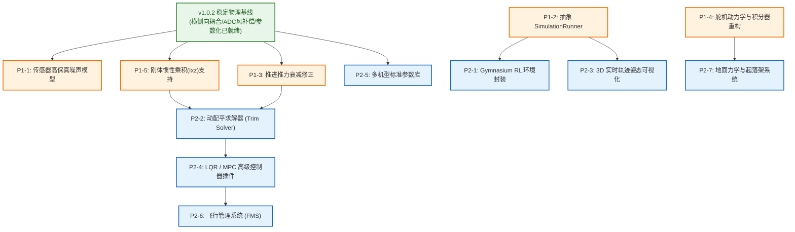

# PyFlightSim v2.0 架构与工程升级技术规格书 (P1 - P2)

> **版本**：v2.0-Roadmap  
> **更新日期**：2026-09-14  
> **基础依赖版本**：[PyFlightSim v1.0.2-Stable](PyFlightSim_v1.0.md) (已包含 Phase 1 ~ Phase 7 物理基线)  
> **基线代码库**：PyFlightSim (6-DOF Flight Dynamics & GNC Simulation)  
> **文档定位**：系统级升级路线图、物理建模规范与工程重构技术指南

---

## 目录
1. [基线说明与前置审查摘要 (Executive Audit Summary)](#1-基线说明与前置审查摘要-executive-audit-summary)
2. [总体架构演进与依赖拓扑](#2-总体架构演进与依赖拓扑)
3. [P1 阶段：仿真高保真度与工程可用性重构](#3-p1-阶段仿真高保真度与工程可用性重构)
   - [P1-1: 传感器高保真误差与随机过程噪声模型](#p1-1-传感器高保真误差与随机过程噪声模型)
   - [P1-2: 抽象标准化生命周期调度器 `SimulationRunner`](#p1-2-抽象标准化生命周期调度器-simulationrunner)
   - [P1-3: 推进系统高空密度与前飞速度推力衰减修正](#p1-3-推进系统高空密度与前飞速度推力衰减修正)
   - [P1-4: 执行机构动力学建模与积分器时间求值重构 (修正因果律悖论)](#p1-4-执行机构动力学建模与积分器时间求值重构-修正因果律悖论)
   - [P1-5: 刚体运动学完整惯性张量与横侧向惯性乘积 (Ixz) 支持](#p1-5-刚体运动学完整惯性张量与横侧向惯性乘积-ixz-支持)
4. [P2 阶段：先进控制算法与生态外延扩展](#4-p2-阶段先进控制算法与生态外延扩展)
   - [P2-1: Gymnasium 标准强化学习交互接口封装](#p2-1-gymnasium-标准强化学习交互接口封装)
   - [P2-2: 六自由度非线性动配平求解器 (Trim Solver)](#p2-2-六自由度非线性动配平求解器-trim-solver)
   - [P2-3: 实时飞行轨迹与机体姿态轻量化 3D 可视化](#p2-3-实时飞行轨迹与机体姿态轻量化-3d-可视化)
   - [P2-4: 现代控制架构与 LQR / 线性化插件支持](#p2-4-现代控制架构与-lqr--线性化插件支持)
   - [P2-5: 经典教学与科研多机型标准参数库建设](#p2-5-经典教学与科研多机型标准参数库建设)
   - [P2-6: 基础飞行管理系统 (FMS) 与 LNAV/VNAV 航路规划](#p2-6-基础飞行管理系统-fms-与-lnavvnav-航路规划)
   - [P2-7: 地面力学与起落架接触碰撞动力学系统](#p2-7-地面力学与起落架接触碰撞动力学系统)
5. [升级实施总览矩阵 (Engineering Matrix)](#5-升级实施总览矩阵-engineering-matrix)
6. [外部依赖项与环境演进清单](#6-外部依赖项与环境演进清单)

---

## 1. 基线说明与前置审查摘要 (Executive Audit Summary)

本规格书是 PyFlightSim 迈向学术科研级与高可信度仿真的核心规划文档。在开启 v2.0 开发之前，系统的底层地基已经完成了重大加固：

1. **v1.0.2 物理补丁已全量落地**：
   * 原升级设想中的 P0 级底层缺陷（横侧向气动力矩缺失、ADC 传感器风矢量未补偿、升降舵气动导数硬编码），已作为 **[v1.0.2 补丁 (Phase 7)](PyFlightSim_v1.0.md#phase-7-物理基准与气动耦合终极修复-v102-patch)** 全面修复入库，并 100% 通过单元测试。
   * 因此，**本 v2.0 规格书不再将上述物理修复列为待办任务，而是直接以 v1.0.2 稳定物理内核作为前置基线**。
2. **修正因果律与控制工程悖论 (原 P1-4 修订)**：
   * *原描述*：曾在 RK4 子步内提出“利用历史与当前步控制量进行线性插值”。
   * *审查指正*：在数字闭环控制中，未来控制量由未来状态决定，积分内部不可预知；使用历史插值会人为引入相位滞后。现实中舵面的平滑由伺服电机的物理惯性承担。
   * *正规方案*：将方案确立为**执行器一阶动力学建模 (Actuator Dynamics)**（舵面作为连续状态量随刚体同步推进），并赋予积分器显式绝对时间签名。
3. **建立严格的量化验收准则**：
   * 为本规划中的每一个进阶任务制定了清晰的数学物理方程、配置契约与单元测试判据。

---

## 2. 总体架构演进与依赖拓扑



---

## 3. P1 阶段：仿真高保真度与工程可用性重构
*此类升级旨在消除工程代码坏味道、提升数值计算精度，为导航算法和现代控制提供高保真验证平台。*

---

### P1-1: 传感器高保真误差与随机过程噪声模型

* **涉及文件**：
  * `modules/sensors/imu.py`, `gps.py`, `air_data.py`
  * `configs/sensors.yaml` (新建)
* **缺陷成因剖析**：
  现有传感器是对真值的直通输出（透传），导致任何状态估计算法（如卡尔曼滤波 EKF、互补滤波）在当前环境下失去验证意义。
* **技术设计与数学模型**：
  1. **IMU 误差模型 (陀螺仪与加速度计)**：
     * 输出方程：$y(t) = x_{true}(t) + b(t) + \eta_{white}(t)$
     * 动态零偏游走 (一阶高斯-马尔可夫过程)：$\dot{b}(t) = -\frac{1}{\tau_b} b(t) + \eta_b(t)$
  2. **GPS 误差与延迟模型**：
     * 采用采样频率限制器（如 5Hz / 10Hz 离散更新），非更新周期保持零阶保持 (ZOH)；
     * 水平位置注入水平圆误差高斯噪声（$\sigma_{h} \approx 1.5\text{m}$），垂直高度注入气压/几何高程误差（$\sigma_{v} \approx 3.0\text{m}$）；
     * 引入可配置的时间滞后环形缓冲区（FIFO Delay Buffer, 100ms~200ms）。
  3. **全局真值/噪声开关**：
     * 配置文件支持 `enable_noise: false`，保证自动测试与控制调参时可瞬时回退至理想真值。
* **验收标准 (Acceptance Criteria)**：
  1. 长时间（300s）静止工况下，采集 IMU 输出序列，样本方差与配置设定的白噪声谱密度吻合度 $\ge 95\%$，零偏具备明显低频漂移特征。
  2. GPS 在 100Hz 物理主循环下，输出读数呈现阶梯状更新（对应配置的 10Hz）。

---

### P1-2: 抽象标准化生命周期调度器 `SimulationRunner`

* **涉及文件**：
  * `modules/runner.py` (新建核心调度类)
  * 重构 `run_simulation.py` 与 `examples/turn.py`
* **缺陷成因剖析**：
  配置解析、动力学对象装配、传感器时序轮询、主循环步进等样板代码在入口脚本和示例之间重复率超 80%，极易因单处修改遗漏导致各脚本行为不一致。
* **技术设计与架构规格**：
  * 单步执行管线（严格按照因果律时序推进）：
    1. `Environment Step` (更新大气属性、风场)
    2. `Aerodynamics & Propulsion` (基于当前真实相对气流解算力和力矩)
    3. `Physics Integration` (RK4 状态微分推进)
    4. `Sensor Pipeline` (更新带噪声/延迟的传感器读数)
    5. `Data Logging` (沉淀时间序列)
* **验收标准 (Acceptance Criteria)**：
  * `run_simulation.py` 和 `examples/turn.py` 代码量精简至 50 行以内（仅保留任务逻辑与航路点规划）。
  * 相同工况下运行新旧实现，输出轨迹数据均方根误差 (RMSE) 小于 $10^{-6}$。

---

### P1-3: 推进系统高空密度与前飞速度推力衰减修正

* **涉及文件**：
  * `modules/dynamics/forces.py`
  * `configs/aircraft.yaml`
* **缺陷成因剖析**：
  现有代码为 $F_{thrust} = T_{max} \cdot \delta_{throttle}$。活塞螺旋桨发动机在高空空气稀薄时进气量下降、功率衰减，且高速前飞时螺旋桨有效迎角减小，导致高空和俯冲时推力严重偏高。
* **技术设计与物理公式**：
  * 大气密度比：$\sigma = \frac{\rho(h)}{\rho_0}$，其中 $\rho_0 = 1.225\text{ kg/m}^3$。
  * 推力物理模型（结合密度衰减与进距速度衰减）：
    $$F_x += T_{max} \cdot \delta_{throttle} \cdot \sigma^{1.1} \cdot \max\left(0, 1 - \frac{V_{tas}}{V_{max\_dive}}\right)$$
  
  > [!NOTE]
  > 这里的随速度线性衰减模型为教学用的一阶简化模型。公式中的 $V_{max\_dive}$ 意为“推力归零等效速度”（定距桨特性抽象），并非代指飞机手册上的结构限制速度 $V_{NE}$。

* **验收标准 (Acceptance Criteria)**：
  1. 高度对比测试：海平面满油门静态推力为 $3000\text{ N}$；当爬升至 $5000\text{m}$ 时，满油门静态推力平滑衰减至约 $1700\text{ N}$。
  2. 极速截断测试：俯冲超速达到 $V_{max\_dive}$ 时，有效推力自动归零。

---

### P1-4: 执行机构动力学建模与积分器时间求值重构 (修正因果律悖论)

* **涉及文件**：
  * `modules/dynamics/integrator.py`
  * `modules/dynamics/actuator.py` (新建)
  * `modules/dynamics/forces.py`
* **技术设计与正规解法**：
  1. **伺服舵机动力学建模 (Actuator Dynamics)**：
     * 将实际舵面偏角 $\boldsymbol{\delta}_{act} = [\delta_e, \delta_a, \delta_r]^T$ 引入状态微分方程，具备一阶滞后与饱和速率截断：
       $$\dot{\boldsymbol{\delta}}_{act} = \mathrm{clip}\left(\frac{\boldsymbol{\delta}_{cmd} - \boldsymbol{\delta}_{act}}{\tau_{actuator}}, -v_{rate\_max}, v_{rate\_max}\right)$$
     * 使得舵面偏角在 RK4 积分过程中自然连续光滑，彻底消除阶跃冲击。
  2. **积分器签名显式时间参数化**：
     * 重构 `Integrator.rk4_step(deriv_func, t, y, dt)`，闭包内各阶段分别按 $t$、$t + 0.5dt$、$t + dt$ 求值，确保时变外生输入（如连续风场剖面 $w(t)$）的时间保真度。
* **验收标准 (Acceptance Criteria)**：
  1. 阶跃输入响应：当飞控给出瞬时满舵阶跃指令时，实际舵面偏角呈现平滑的一阶指数上升曲线，导数有界且不超过配置的最大偏转速率。
  2. 数值平滑性：高动态机动下的角加速度曲线彻底消除阶跃毛刺。

---

### P1-5: 刚体运动学完整惯性张量与横侧向惯性乘积 (Ixz) 支持

* **涉及文件**：
  * `modules/dynamics/kinematics.py`
  * `configs/aircraft.yaml`
* **缺陷成因剖析**：
  当前 `MassProperties` 仅接收对角元素 `Ixx, Iyy, Izz`，强制设置非对角项为 0。然而常规固定翼飞机由于上下机身不完全对称，通常存在不可忽视的 $I_{xz}$（纵侧惯性乘积）。
* **技术设计与矩阵构造**：
  * 惯性张量定义：
    $$J = \begin{bmatrix} I_{xx} & 0 & -I_{xz} \\ 0 & I_{yy} & 0 \\ -I_{xz} & 0 & I_{zz} \end{bmatrix}$$
  * `kinematics.py` 中角加速度更新采用完整逆矩阵：$\dot{\boldsymbol{\omega}} = J^{-1} \left( \boldsymbol{M}_{body} - \boldsymbol{\omega} \times (J \boldsymbol{\omega}) \right)$。
* **验收标准 (Acceptance Criteria)**：
  * 在纯滚转机动中输入大滚转角速度 $p$，验证动力学方程能正确通过 $I_{xz}$ 耦合出诱导俯仰/偏航力矩分量。

---

## 4. P2 阶段：先进控制算法与生态外延扩展
*此类升级大幅拓展项目的研究深度、教学价值与工业/科研生态位。*

---

### P2-1: Gymnasium 标准强化学习交互接口封装

* **涉及文件**：`modules/rl/flight_env.py`, `examples/train_rl_agent.py`
* **技术设计**：继承 `gymnasium.Env`，提供标准化动作空间（4通道连续控制）与观测空间（18维全状态向量），支持即插即用的奖励函数。
* **验收标准**：通过 `gymnasium.utils.env_checker.check_env` 测试，可直接接入 Stable-Baselines3 (PPO/SAC) 训练。

---

### P2-2: 六自由度非线性动配平求解器 (Trim Solver)

* **涉及文件**：`tools/trim_solver.py`, `configs/trim_targets.yaml`
* **技术设计**：利用 `scipy.optimize.root` 求解非线性平衡零点：$\boldsymbol{z} = [\alpha, \beta, \phi, \delta_e, \delta_a, \delta_r, \delta_{throttle}]^T$ 使得合力和力矩导数全部为零。
* **验收标准**：配平状态作为初始值全开环运行 20 秒，高度漂移 $< 0.5\text{m}$，空速漂移 $< 0.1\text{m/s}$。

---

### P2-3: 实时飞行轨迹与机体姿态轻量化 3D 可视化

* **涉及文件**：`tools/visualizer_3d.py`
* **技术设计**：非侵入式多进程架构，主仿真向队列投递数据，独立子进程采用轻量 OpenGL/PyQtGraph 渲染 3D 线框姿态与航迹曲线。
* **验收标准**：开启 3D 渲染时，100Hz 物理主循环无丢步，渲染帧率稳定维持在 30FPS 以上。

---

### P2-4: 现代控制架构与 LQR / 线性化插件支持

* **涉及文件**：`modules/control/base_controller.py`, `tools/linearizer.py`, `modules/control/lqr.py`
* **技术设计**：中心差分法提取雅可比矩阵 $(A, B)$，求解连续代数黎卡提方程 (CARE) 得到状态反馈矩阵 $K$。
* **验收标准**：注入 $5^\circ$ 俯仰阶跃扰动，LQR 控制器能在 3 秒内恢复配平平衡，闭环极点实部均严格小于 0。

---

### P2-5: 经典教学与科研多机型标准参数库建设

* **涉及文件**：`configs/aircraft/cessna172.yaml`, `f16.yaml`, `aerosonde_uav.yaml`
* **技术设计**：基于 Stevens & Lewis 及 Beard & McLain 等权威文献建立标准参数集与 YAML Schema 校验。
* **验收标准**：修改配置文件路径即可在同一套物理引擎下稳定仿真不同动态特性的机型。

---

### P2-6: 基础飞行管理系统 (FMS) 与 LNAV/VNAV 航路规划

* **涉及文件**：`modules/avionics/fms.py`, `configs/routes.yaml`
* **技术设计**：
  * **航路点管理**：解析包含经纬度/坐标、高度、速度限制的 4D 航路点列表。
  * **水平导航 (LNAV)**：计算当前位置到期望航段的横向偏航误差 (Cross-track Error)，生成目标滚转角/航向。
  * **垂直导航 (VNAV)**：基于下降率限制计算下降顶点 (TOD)，生成目标高度曲线。
* **验收标准**：读取航路点文件，飞机在自动驾驶开启下依次通过所有航路点（横向误差 < 100m），并在接近目标时自动完成巡航到下降的状态切换。

---

### P2-7: 地面力学与起落架接触碰撞动力学系统

* **涉及文件**：`modules/dynamics/ground.py`, `modules/dynamics/gear.py`
* **物理建模与风险控制**：前三点式起落架几何接触检测，非线性弹簧阻尼接触力模型与刷子轮胎侧偏摩擦。（**注意数值刚性，需前置依赖积分器重构**）。
* **验收标准**：飞机以 $-1.5\text{m/s}$ 下沉率接地，起落架正确吸收动能平稳转入地面滑跑。

---

## 5. 升级实施总览矩阵 (Engineering Matrix)

| 事项编号 | 升级任务名称 | 优先级 | 核心修改与功能点 | 涉及核心文件 | 前置依赖 | 风险 | 状态 |
| :--- | :--- | :---: | :--- | :--- | :---: | :---: | :---: |
| **P1-1** | 传感器高保真误差噪声 | **P1** | 高斯白噪声、零偏游走与延迟缓冲 | `imu.py`, `gps.py` 等 | v1.0.2 基线 | 低 | ⏳ 待办 |
| **P1-2** | 抽象 SimulationRunner | **P1** | 封装统一生命周期调度管线 | `runner.py` 等 | v1.0.2 基线 | 中 | ⏳ 待办 |
| **P1-3** | 推进推力衰减模型 | **P1** | 引入密度比 $\sigma$ 与前飞速度衰减 | `forces.py` | v1.0.2 基线 | 低 | ⏳ 待办 |
| **P1-4** | 舵机动力学与积分重构 | **P1** | 舵机一阶连续状态，显式时间积分 | `actuator.py`, `integrator.py` | 无 | 中 | ⏳ 待办 |
| **P1-5** | 惯性张量乘积 $I_{xz}$ 支持 | **P1** | 构建完整 $3\times3$ 横侧惯性耦合矩阵 | `kinematics.py` | 无 | 低 | ⏳ 待办 |
| **P2-1** | Gymnasium RL 接口封装 | **P2** | 标准动作/观测空间与环境封装 | `flight_env.py` | P1-2 | 低 | ⏳ 待办 |
| **P2-2** | 6-DOF 动配平求解器 | **P2** | 基于数值优化求解稳态配平零点 | `trim_solver.py` | P1-3, P1-5 | 中 | ⏳ 待办 |
| **P2-3** | 3D 实时轨迹姿态显示 | **P2** | 异步多进程极简姿态与航迹渲染 | `visualizer_3d.py` | P1-2 | 低 | ⏳ 待办 |
| **P2-4** | 现代控制 LQR 插件架构 | **P2** | 中心差分线性化并求解代数黎卡提 | `base_controller.py`, `lqr.py` | P2-2 | 中 | ⏳ 待办 |
| **P2-5** | 多机型标杆参数库 | **P2** | 建设 F-16 与 Aerosonde 标准集 | 各个 `yaml` 配置 | v1.0.2 基线 | 低 | ⏳ 待办 |
| **P2-6** | FMS 与 LNAV/VNAV 导航 | **P2** | 4D航路规划与四维导航偏航追踪 | `fms.py`, `routes.yaml` | P2-4 | 中 | ⏳ 待办 |
| **P2-7** | 地面接触力学与起落架 | **P2** | 强刚性接触碰撞与轮胎滑跑动力学 | `ground.py`, `gear.py` | P1-4 | 高 | ⏳ 待办 |

---

## 6. 外部依赖项与环境演进清单

```txt
# 核心数值与配置基础 (现有)
numpy>=1.20.0
PyYAML>=6.0
matplotlib>=3.5.0
pandas>=1.3.0

# 进阶控制与优化扩展 (P2-2 配平求解, P2-4 线性化与代数黎卡提求解)
scipy>=1.9.0

# 人工智能强化学习生态 (P2-1 智能体训练基座)
gymnasium>=0.29.0

# 轻量化 3D 异步可视化 (P2-3 可视化，可选组件)
pyqtgraph>=0.13.0
PyQt5>=5.15.0

# 工程测试与质量守门 (自动化测试框架)
pytest>=7.0.0
```
